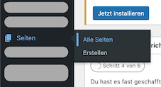
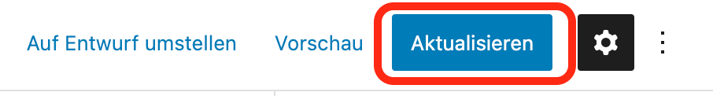

# Unsere Chorgruppen

Die Seite *Unsere Chorgruppen* befindet sich im Menü unter *Mitmachen*.

## Bevor du loslegst

Melde dich in den Wordpress-Administratoren-Bereich unter [www.dev.musikwerk-stuttgart.de/wp-admin](http://www.dev.musikwerk-stuttgart.de/wp-admin) an und klick auf *Seiten*.

## Text auf der Überblicksseite anpassen

1. Navigiere zur Seite *Unsere Chorgruppen* und klick auf *Bearbeiten*.

Die Texte auf der Überblicksseits sind in Textblöcke definiert.
1. Einen Textblock auswählen und den Text wie gewünscht anpassen.

1. Deine Änderungen anschließend veröffentlichen.

## Text auf der Detailseite anpassen

1. Das Verzeichnis *Chöre* auswählen. 

1. Rechts die Seite für den Chor auswählen, die du bearbeiten willst und auf *Bearbeiten* klicken.

Die Texte auf der Überblicksseits sind in Textblöcke definiert.
1. Einen Textblock auswählen und den Text wie gewünscht anpassen.

1. Deine Änderungen anschließend über *Aktualisieren* veröffentlichen.

## Bilder austauschen

<!-- Content here is almost identical to that in the "Fotos" section. Can we add some reuse? -->

Die Bilder und die Galerien werden mit einem Plugin namens **Modula** erstellt.

Allgemeine Informationen zum Modula-Plugin ist in der Dokumentation unter [https://wp-modula.com/knowledge-base/](https://wp-modula.com/knowledge-base/) zu finden.

### Bevor du loslegst

Melde dich in den Wordpress-Administratoren-Bereich unter [www.dev.musikwerk-stuttgart.de/wp-admin](http://www.dev.musikwerk-stuttgart.de/wp-admin) an und klick auf *Modula*.

1. Die Galerie für den Chor finden und auf *Bearbeiten* klicken.

1. Die Bilder hochladen oder anpassen:

#### Wenn die Bilder auf deinem lokalen Rechner liegen:

1. Klick auf *Upload image files*.

1. Die Bilder von deinem Rechner auswählen.

Die Bilder erscheinen dann im Bereich *Gallery*.

#### Wenn die Bilder schon in der Bibliothek existieren:

1. Klick auf *Select from library*.

1. Die Bilder auswählen und auf *Zur Galerie hinzufügen* klicken.

Die Bilder erscheinen dann im Bereich *Gallery*.

1. Rechts auf *Update Gallery* klicken.
