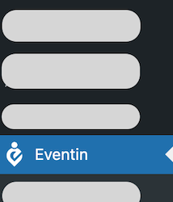
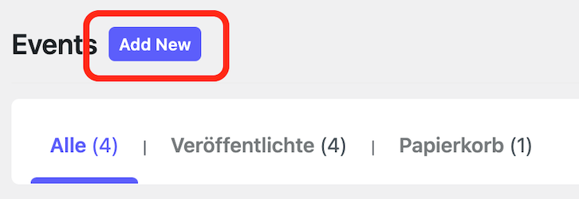
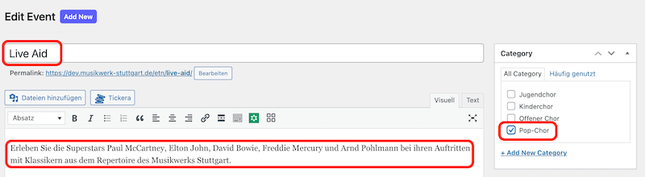
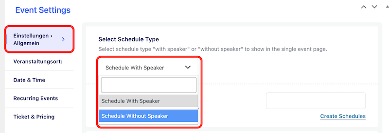
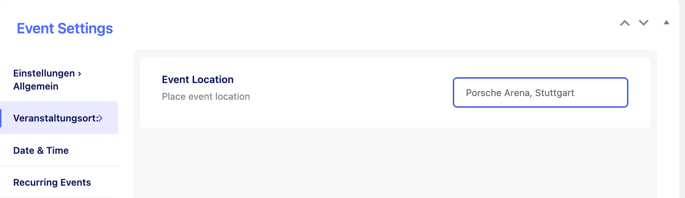
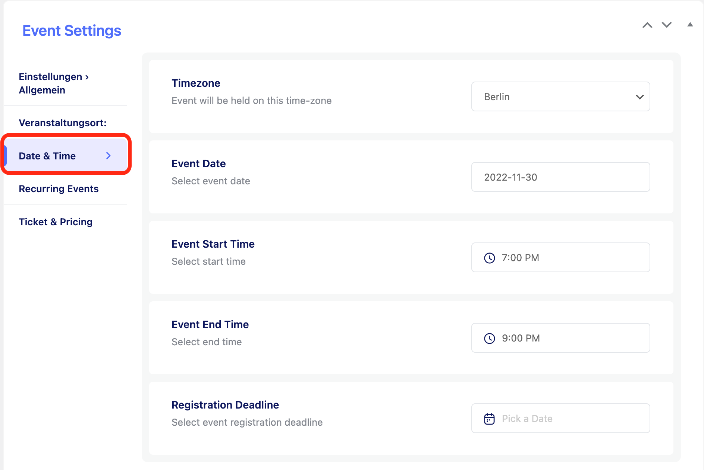

# Events

Events werden mit dem Plugin **Eventin** gepflegt.

Allgemeine Informationen zum Eventin-Plugin ist in der Dokumentation unter [https://support.themewinter.com/docs/plugins/plugin-docs/event/eventin-event/](https://support.themewinter.com/docs/plugins/plugin-docs/event/eventin-event/) zu finden.

## Bevor du loslegst

Melde dich in den Wordpress-Administratoren-Bereich unter [www.dev.musikwerk-stuttgart.de/wp-admin](http://www.dev.musikwerk-stuttgart.de/wp-admin) an und klick auf *Eventin*.

## Event hinzufügen

1. Im Kopfbereich auf *Add New* klicken.

1. Einen Namen und eine Beschreibung für den Event eingeben und die beteiligten Chöre im Bereich *Category* selektieren.

1. Im Bereich *Event Settings* den Reiter *Einstellungen allgemein* aufmachen und den Eintrag im Dropdown-Menü auf *Schedule Without Speaker* ändern.

1. Auf dem Reiter *Veranstaltungsort* die Adresse der Veranstaltung eingeben.

1. Auf dem Reiter *Date & Time* das Datum und die Uhrzeit der Veranstaltung eingeben.

---
**HINWEIS**

Beim Datum musst du ein Start- und Enddatum eintragen. Wenn die Veranstaltung nur an einem Tag stattfindet, musst du das Datum zweimal anklicken.

---

## Event entfernen

1. Pommy ipsum nowt teacakes well fit a bit wonky the old bill, nutter Bob's your uncle Geordie how's your father. 
1. And we all like figgy pudding porky-pies bread and butter pudding wind up twiglets spiffing working class.
1. It's cracking flags, sling one's hook what a doddle Southeners one would like therewith bag egg's old boy.

## Weitere Informationen

[https://support.themewinter.com/docs/plugins/plugin-docs/event/eventin-event/](https://support.themewinter.com/docs/plugins/plugin-docs/event/eventin-event/)