# Fotos

Die Bilder und die Galerien werden mit einem Plugin namens **Modula** erstellt.

Allgemeine Informationen zum Modula-Plugin ist in der Dokumentation unter [https://wp-modula.com/knowledge-base/](https://wp-modula.com/knowledge-base/) zu finden.

## Bevor du loslegst

Melde dich in den Wordpress-Administratoren-Bereich unter [www.dev.musikwerk-stuttgart.de/wp-admin](http://www.dev.musikwerk-stuttgart.de/wp-admin) an und klick auf *Modula*.

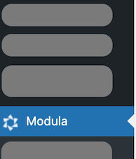

## Neue Galerie erstellen

Bevor du Bilder hinzufügen kannst, musst du eine Galerie anlegen. Die Galerie sammelt all deiner Bilder von deiner Veranstaltung.

**Um eine Galerie anzulegen:**

1. Im Kopfbereich auf *Add New* klicken.
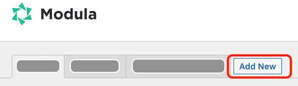

1. Einen Namen für die neue Galerie eintragen.
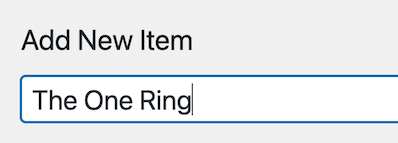

1. Im Bereich *Veröffentlichen* auf *Speichern* (**nicht** auf Save Gallery!) klicken.
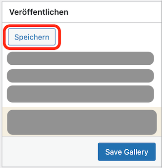

## Eine bestehende Galerie kopieren

Der einfachste Weg, eine neue Galerie zu erstellen, ist, eine bestehende Galerie zu kopieren. Auf diese Weise sind alle (oder zumindest die meisten) Einstellungen, die du benötigst, bereits konfiguriert.

**Um eine Galerie zu kopieren:**

1. Die zu kopierende Gallerie auf der Überblicksseite suchen und auf *Duplicate gallery* klicken.
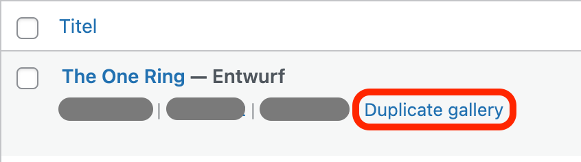

## Bilder hinzufügen

Nachdem du deine Gallerie erstellt hast, musst du die Bilder hochladen. Die Bilder können schon in der Wordpress-Bibliothek liegen oder auch auf deinem lokalen Rechner.

---
**TIPP**

Fürs Deckbild auf die Hauptfotoseite [(https://dev.musikwerk-stuttgart.de/fotos)](https://dev.musikwerk-stuttgart.de/fotos) brauchst du ein Bild in der Größe 300 x 200 px. Bevor du deine Bilder hochlädst, solltest du prüfen, dass du so ein Bild hast.

---

**Wenn die Bilder auf deinem lokalen Rechner liegen:**

1. Klick auf *Upload image files*.
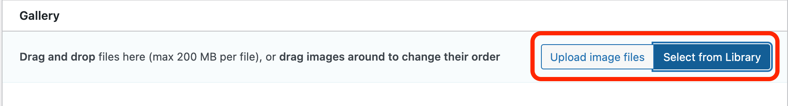
1. Die Bilder von deinem Rechner auswählen.

Die Bilder erscheinen dann im Bereich *Gallery*.

**Wenn die Bilder schon in der Bibliothek existieren:**

1. Klick auf *Select from library*.

1. Die Bilder auswählen und auf *Zur Galerie hinzufügen* klicken.
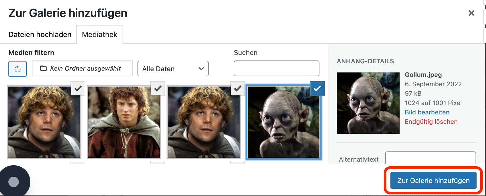

Die Bilder erscheinen dann im Bereich *Gallery*.

## Galerie konfigurieren

Wenn du eine bestehende Galerie kopiert hast (siehe [Eine bestehende Galerie kopieren](#eine-bestehende-galerie-kopieren)), dann sollte deine neue Galerie schon vorkonfiguriert sind. Wenn du aber deine Galerie selber angelegt hast, musst du die folgenden Einstellungen im Bereich *General* vornehmen:

| Feld | Einstellung |
| ------ | ------------- |
| Gallery Type | Custom Grid |
| Gutter | 2px 2px 2px |
| Image Size | Medium |
| Max Images Count | leer |
| Mobile Max Images Count | leer |
| Powered by | ausgeschaltet |

## Galerie veröffentlichen

Bevor deine Bilder auf der Website erscheinen können, musst du die Galerie veröffentlichen. 

1. Klick auf *Save Gallery* auf der rechten Seite des Bildschirms.

    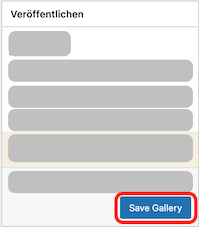

    Modula erstellt dann einen sogenannten Shortcode, worüber du die Galerie in die Website integrieren kannst.

    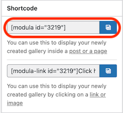

1. Kopierst den Shortcode in die Zwischenablage.

## Eine Fotoseite anlegen

Jetzt hast du deine Galerie erstellt und die Bilder hinzugefügt. Als nächstes Schritt musst du eine eigene Seite für die neue Galerie anlegen.

1. In der linken Leiste auf *Seiten > Alle Seiten* klicken.

    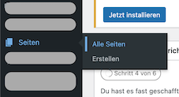

1. Im Kopfbereich auf *Seiten erstellen* klicken

    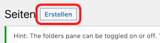

1. Einen Titel für die Seiten eingeben und dann auf dem Plus (+) klicken.

    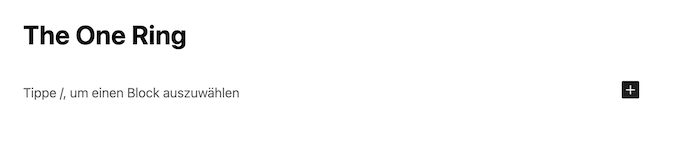

1. Shortcode auswählen.

    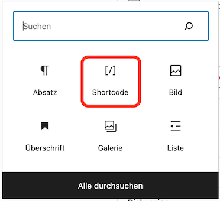

1. Den Modula-Shortcode aus der Zwischenablage einfügen.

    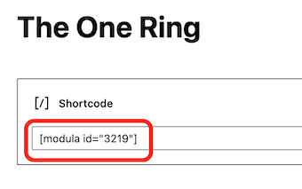

1. Obenrechts auf *Veröffentlichen* klicken.

    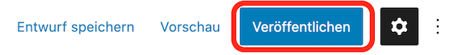

1. Die Adresse der Seite in die Zwischenablage kopieren.

    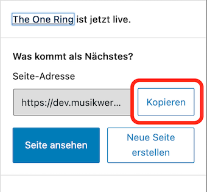

## Die neue Seite anordnen

Nachdem du deine Fotoseite angelegt hast, erscheint sie zuerst unter *Unassigned Items*. Du musst die also ins Verzeichnis fürs entsprechende Jahr verschieben.

1. Auf *Unassigned Items* klicken und deine neue Seite in der Liste suchen.
1. Mit Mausover auf die Seite auf *QuickEdit* klicken.

    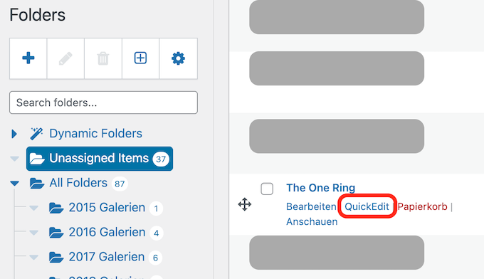

1. Unter *Seite Folders* das Häkchen fürs richtige Jahr setzen und dann auf *Aktualisieren* klicken.

    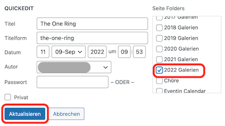

Deine Seite erscheint nun im ausgewählten Verzeichnis.

## Die Hauptseite anpassen

Du musst jetzt deine neue Fotoseite der Hauptseite hinzufügen.

1. Auf *Hauptseiten* klicken und dann auf *Fotos*.

    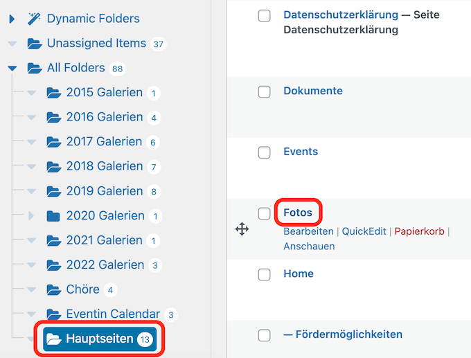

1. Auf dem Plus (+) klicken und ein Bild hinzufügen.

    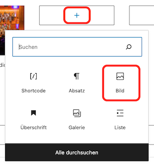

1. Dein Titelbild hochladen oder aus der Mediathek wählen. Das Bild muss die Größe 300 x 200 px haben.

    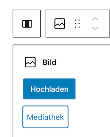

1. Eine Beschriftung hinzufügen.

    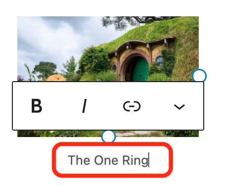

1. In der Symbolleiste fürs Bild (**nicht** für die Beschriftung) auf *Link einfügen* klicken.

    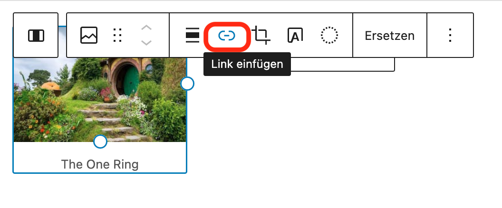

1. Die Adresse deiner Fotoseite aus der Zwischenablage einfügen.

    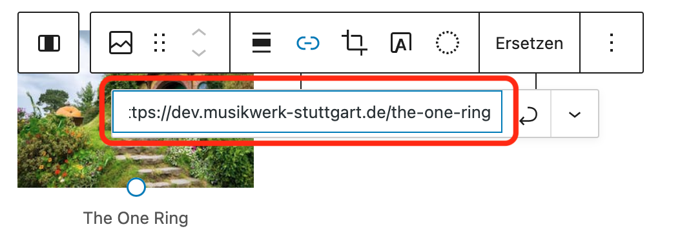

1. Die Seite aktualisieren.

    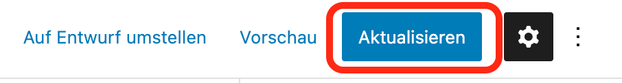