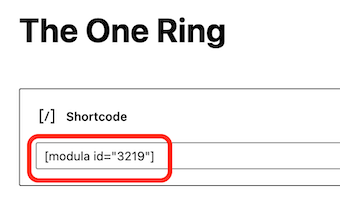
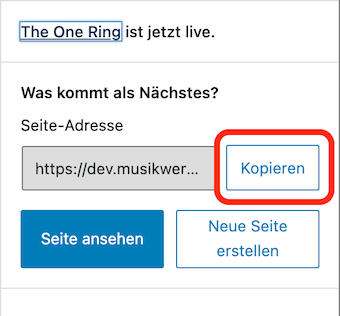

# Eine Fotoseite anlegen

Jetzt hast du deine Galerie erstellt und die Bilder hinzugefügt. Als nächstes Schritt musst du eine eigene Seite für die neue Galerie anlegen.

1. In der linken Leiste auf *Seiten > Alle Seiten* klicken.

    

1. Im Kopfbereich auf *Seiten erstellen* klicken

    

1. Einen Titel für die Seiten eingeben und dann auf dem Plus (+) klicken.

    

1. Shortcode auswählen.

    

1. Den Modula-Shortcode aus der Zwischenablage einfügen.

    

1. Obenrechts auf *Veröffentlichen* klicken.

    

1. Die Adresse der Seite in die Zwischenablage kopieren.

    