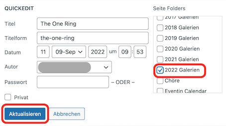

# Die neue Seite anordnen

Nachdem du deine Fotoseite angelegt hast, erscheint sie zuerst unter *Unassigned Items*. Du musst die also ins Verzeichnis fürs entsprechende Jahr verschieben.

1. Auf *Unassigned Items* klicken und deine neue Seite in der Liste suchen.
1. Mit Mausover auf die Seite auf *QuickEdit* klicken.

    

1. Unter *Seite Folders* das Häkchen fürs richtige Jahr setzen und dann auf *Aktualisieren* klicken.

    

Deine Seite erscheint nun im ausgewählten Verzeichnis.