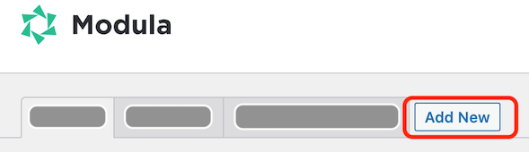

# Neue Galerie erstellen

Bevor du Bilder hinzufügen kannst, musst du eine Galerie anlegen. Die Galerie sammelt all deiner Bilder von deiner Veranstaltung.

**Um eine Galerie anzulegen:**

1. Im Kopfbereich auf *Add New* klicken.

1. Einen Namen für die neue Galerie eintragen.

1. Im Bereich *Veröffentlichen* auf *Speichern* (**nicht** auf Save Gallery!) klicken.
