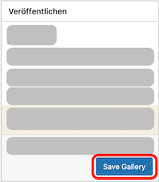
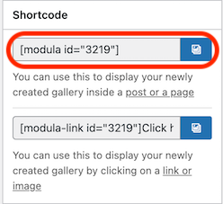

# Galerie veröffentlichen

Bevor deine Bilder auf der Website erscheinen können, musst du die Galerie veröffentlichen. 

1. Klick auf *Save Gallery* auf der rechten Seite des Bildschirms.

    

    Modula erstellt dann einen sogenannten Shortcode, worüber du die Galerie in die Website integrieren kannst.

    

1. Kopierst den Shortcode in die Zwischenablage.